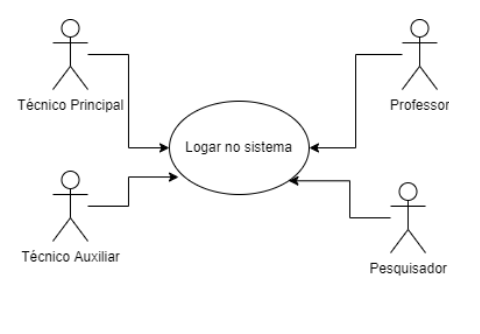
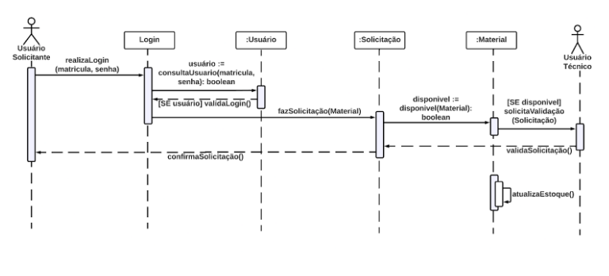
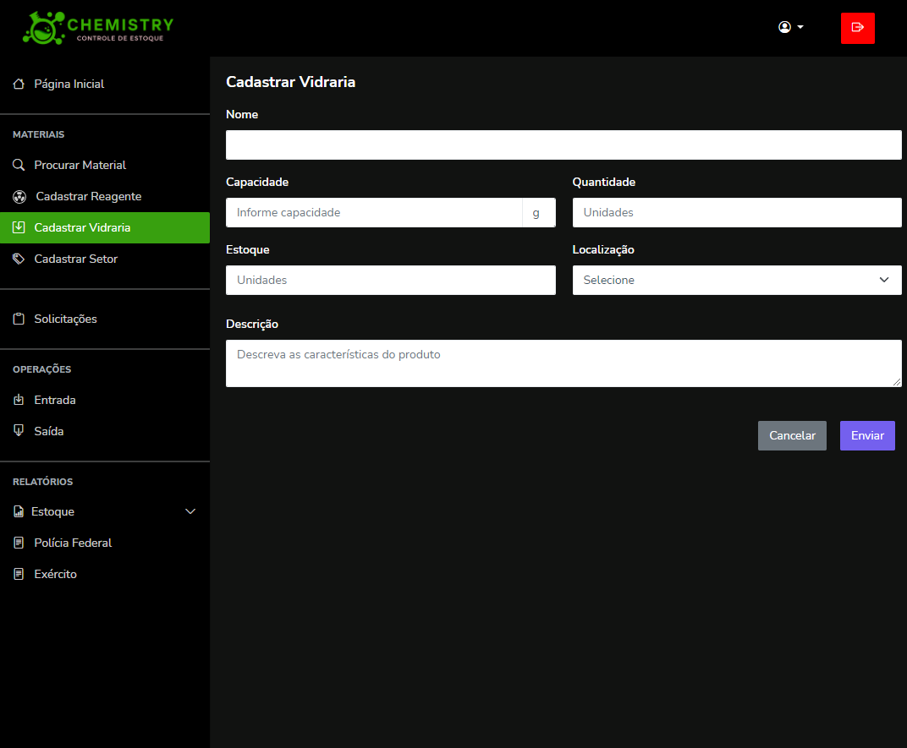
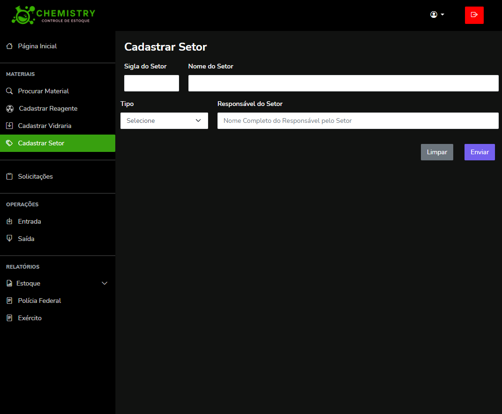

# ChemistryControleDeEstoque
Repositório da aplicação Chemistry que servirá para o controle de estoque e de requisições dos reagentes e vidrarias de laboratórios de química do Instituto Federal do Maranhão.

# Chemistry: controle de estoque
<fig>

</fig>

## Ferramentas
* [VSCode](https://code.visualstudio.com/) - IDE para desenvolvimento.
* [Postman]() - Plataforma de API
* [MySQLWorkbench](https://www.mysql.com/products/workbench/) - IDE para armazenamento da base de dados.

# Chemistry: controle de estoque

CHEMISTRY

## Introdução

Este sistema possui o objetivo principal de auxiliar na gestão e controle de vidrarias e reagentes químicos dos laboratórios de química do Instituto Federal do Maranhão. É possível adicionar, remover e editar os produtos, e registrar solicitações de materiais feitas pelos professores e alunos pesquisadores do instituto.

O estoque pode ser acessado através de qualquer navegador *web*.

## Análise técnica

### Descrição do ambiente técnico

O sistema é composto por um banco de dados e uma interface web. Funcionalidades principais:

* **F1** - Solicitação de materiais
* **F2** - Cadastro de usuários e materiais
* **F3** - Controle de estoque

As ferramentas utilizadas para o desenvolvimento incluem Java, que é uma linguagem de programação utilizada para o Back-end (Spring Boot), para front-end foi utilizado HTML, CSS e JavaScript, e MySQL atuando como sistema gerenciador de banco de dados relacional.

### Histórico de revisões do documento

| DATA | VERSÃO | DESCRIÇÃO DA ALTERAÇÃO | AUTOR |
| --- | --- | --- | --- |
| 19/05/2022 | 1.1 | Criação deste Documento. | Todos |
| 23/06/2021 | 1.2 | Inclusão dos Diagramas de Caso de Uso. | Eduardo e Regiana | 
| 24/06/2021 | 1.3 | Inclusão do Diagrama de Classes. | Ana Paula e Andressa | 
| 24/06/2022 | 1.4 | Inclusão da Especificação do Caso de Uso 4, Diagrama de Sequência e Transição de Estado. | Eduardo |
| 25/05/2021 | 1.5 | Inclusão de RF003, RF004, RF006, RF007, RF009, RF010, RF012, RF013, RF014 e RF015. Alteração dos Requisitos RF011, RF016, RF017 e RF018. | Todos |
| 25/05/2021 | 1.6 | Inclusão dos Diagramas dos Casos de Uso 2, 3, 5, 6 e 8. | Regiana |
| 25/05/2021 | 1.7 | Atualização do Diagrama de Classes. | Ana Paula e Andressa |
| 26/06/2022 | 1.8 | Inclusão da Especificação do Caso de Uso 5 e Diagrama de Transição de Estado. | Ana Paula |
| 26/06/2022 | 1.9 | Inclusão da Especificação do Caso de Uso 6, Diagrama de Sequência e Transição de Estado. | Andressa |
| 26/06/2022 | 1.10 | Inclusão do Diagrama de Sequência e Transição de Estado do Caso de Uso 8. | Regiana |
| 27/06/2022 | 1.11 | Inclusão da Especificação do Caso de Uso 8. | Regiana |
| 27/06/2022 | 1.12 | Inclusão do Diagrama de Sequência do Caso de Uso 5. | Ana Paula |
| 27/06/2022 | 1.13 | Revisão e conclusão | Todos |
| 05/10/2022 | 2.1 | Correção de Casos de Uso | Todos |
| 10/10/22 | 2.2 | Criação dos Diagramas de Transição de Estado, inserção dos Diagramas de Atividades e correção do Diagrama de Classes. | Todos |
| 13/10/22 | 2.3 | Correção do Diagrama de Sequência do Caso de Uso 8. | Regiana |

### Problema de negócio
O sistema de gerenciamento de estoque do laboratório de química tem como objetivo permitir a administração dos devidos produtos (reagente e vidraria) de modo a permitir a adição, remoção e edição dos produtos, além de registar as solicitações feitas pelos professores e alunos pesquisadores aos produtos.

### Levantamento de requisitos  
Os requisitos foram validados com o cliente e aprovados.

### Requisitos Funcionais
Respeitando a proposta, o sistema deverá atender os seguintes requisitos:

* **RF1** - Criar e manter três perfis de Usuário.
* **RF2** - Criar e manter Usuários.
* **RF3** - Cadastrar e manter Categorias.
* **RF4** - Cadastrar e manter Setores.
* **RF5** - Cadastrar e manter Materiais.
* **RF6** - Atualizar Estoque.
* **RF7** - Procurar Materiais.
* **RF8** - Realizar Solicitação.
* **RF9** - Visualizar Solicitações.
* **RF10** - Validar Solicitações.
* **RF11** - Emitir FISPQ.
* **RF12** - Emitir Relatório Parcial e Geral.
* **RF13** - Emitir Relatório para Polícia Federal.
* **RF14** - Emitir Relatório para o Exército.
* **RF15** - Emitir Relatório com listagem de Materias para reposição.

### Requisitos Não Funcionais
Respeitando a proposta, o sistema deverá atender os seguintes requisitos não funcionais:

* **RNF1** - Estrutura Organizacional do Sistema.
* **RNF2** - Desenvolvimento para Web.
* **RNF3** - Utilizar Banco de Dados Sql.

## Regras de Negócio

_Solicitação de materiais com antecedência_  

* **RGN1** -  As solicitações de materiais para grupos de ensino devem ser feitas pelo tipo de usuário “Professor” com 48 horas (2 dias) de antecedência do prazo de entrega.

_Validade dos Reagentes_  

* **RGN2** - Os reagentes com validade fora do prazo só deverão ser disponibilizados para funções não relacionadas à pesquisa. Caso contrário, o mesmo deverá estar dentro da validade.

DIAGRAMAS DE CASOS DE USO

## Diagramas de Casos de Uso
* **Caso de Uso 1** - Visão Geral

* **Caso de Uso 2** - Logar no Sistema

* **Caso de Uso 3** - Criar e Manter Materiais

* **Caso de Uso 4** - Procurar Materiais

* **Caso de Uso 5** - Realizar Solicitação

* **Caso de Uso 6** - Visualizar Solicitação

* **Caso de Uso 7** - Atualizar Estoque

* **Caso de Uso 8** - Emitir FISPQ

* **Caso de Uso 9** - Emitir Relatórios

ESPECIFICAÇÃO DE CASOS DE USO

## Especificação de Casos de Uso
* **Caso de Uso 4** - Procurar Materiais

| Objetivo | Requisitos| Atores | Prioridade | Pré-condições |
| :---: | :---: | :---: | :---: | :---: |
| Permitir que o Técnico Principal, o Técnico Auxiliar, os Professores e Pesquisadores encontre os materiais a partir de um determinado tipo de pesquisa, seja por código de barra, por características ou nome, ao realizar a pesquisa pelo mesmo no sistema de Gerenciamento de Materiais. | Ter sido cadastrado como usuário correspondente um dos níveis de acesso que permitam tais ações de procura supracitadas. | Técnico Principal, Técnico Auxiliar, Professores e Pesquisadores. | Alta | Os materiais devem ter sido cadastrados e armazenados no banco de dados anteriormente. |

| Frequência de Uso | Criticalidade | Fluxo Principal | Fluxo Alternativo | Pós-condição |
| :---: | :---: | :---: | :---: | :---: |
| Frequente. | Média. | 1. O usuário deve realizar login. 2. O usuário vai até o menu de busca e descreve a informação que deseja pesquisar. | 1. Ao estar no menu de busca, o usuário pode pesquisar utilizando o nome do material, seu código de barra ou uma característica própria. | 1. Após a pesquisa ter sido realizada, teremos uma lista com os materiais caracterizados pela pesquisa (o resultado pode ser diferente dependendo do tipo de pesquisa utilizada). |

* **Caso de Uso 5** - Realizar Solicitação

| Objetivo | Requisitos| Atores | Prioridade | Pré-condições |
| :---: | :---: | :---: | :---: | :---: |
| Permitir que Professores e Pesquisadores solicitem o material necessário para uso. | Estar cadastrado como Usuário Solicitante e realizar a solicitação com até 48 horas de antecedência. |Professores e Pesquisadores. | Alta | Os materiais (reagentes e vidrarias) devem ter sido cadastrados e armazenados no banco de dados no setor correspondente à solicitação. |

| Frequência de Uso | Fluxo Principal | Fluxo Alternativo | Pós-condição |
| :---: | :---: | :---: | :---: |
| Frequente. | 1. Este caso de uso começa quando um Usuário Solicitante logado realiza uma solicitação de materiais no Sistema. 2. O Sistema verifica a disponibilidade dos materiais solicitados 3. Os materiais solicitados estão disponíveis para o Usuário Solicitante. 4. O Técnico valida a solicitação. 5. O Sistema confirma a solicitação e o Usuário pode fazer a retirada dos materiais solicitados. | 4. Um ou mais materiais solicitados não estão disponíveis. 5. O Sistema informa ao Usuário que a solicitação não foi confirmada. | O estoque de materiais do setor é atualizado no banco de dados. |

* **Caso de Uso 6** - Vizualizar Solicitações

| Objetivo | Requisitos| Atores | Prioridade | Pré-condições |
| :---: | :---: | :---: | :---: | :---: |
| Permitir que o usuário visualize as solicitações, podendo realizar consultas que permitem verificar quais já foram realizadas, além de mostrar as pendentes de aprovação. | Deve haver materiais armazenados no banco de dados que já foram sujeitos previamente a solicitação. | Técnico Principal, Técnico Auxiliar, Professores e Pesquisadores. | Desejável | Ter feito login no sistema, e ser usuário correspondente ao nível de acesso que permite realizar tal ação. |

| Frequência de Uso | Criticalidade | Fluxo Principal | Fluxo Alternativo | Pós-condição |
| :---: | :---: | :---: | :---: | :---: |
| Alta. | Média. | 1. O usuário deve realizar login. 2. O sistema deverá iniciar a janela “Visualizar solicitações”, quando o usuário clicar no item “Pesquisar” do menu na aba de “Solicitações" 3. O sistema iniciará uma conexão com o banco de dados. 4. A exibição de dados pode ser feita de maneira geral ou por busca de solicitação específica. 5. O sistema precisará exibir os dados de todas as solicitações feitas. 6. Caso o usuário deseje buscar uma solicitação em específico, ele deverá informar a vidraria/reagente. 7. O sistema terá de buscar as solicitações associadas às informações requeridas. 8. O sistema então, deverá exibir os dados localizados. | 1. O sistema precisa manter a tela ativa independente do tempo que o usuário leva para informar os dados solicitados, se necessário. 2. Caso o sistema não conseguir realizar a procura pela solicitação deve informar na janela o erro gerado. 3. Ao realizar a busca de solicitações específicas e não encontrar a consulta, o sistema irá informar na janela que não conseguiu localizar as informações referentes à pesquisa escolhida e se possível, por meio de SQL Exceptions, informar o erro gerado. | 1. Após a busca pela solicitação ter sido realizada, o sistema retornará o resultado da consulta com os dados relativos a busca feita de forma detalhada, podendo ser visualizado o“status” de cada solicitação e demais informações necessárias. |

* **Caso de Uso 8** - Emitir FISPQ

| Objetivo | Requisitos| Atores | Prioridade | Pré-condições |
| :---: | :---: | :---: | :---: | :---: |
| Permitir que o usuário tenha acesso ao arquivo em formato PDF (para visualização e download) da Ficha de Informação de Segurança para Produtos Químicos (FISPQ) para cada reagente cadastrado, através da pesquisa pelo mesmo no sistema de Gerenciamento de Materiais. | Ter sido cadastrado como usuário. | Técnico Principal, Técnico Auxiliar, Professores e Pesquisadores. | Alta | Os materiais devem ter sido cadastrados e armazenados no banco de dados anteriormente, junto com o arquivo PDF. |

| Frequência de Uso | Criticalidade | Fluxo Principal | Fluxo Alternativo | Pós-condição |
| :---: | :---: | :---: | :---: | :---: |
| Frequente. | Média. | 1. O usuário realiza o login, informando seus dados cadastrados anteriormente. 2. Na tela principal, clicar na opção Procurar Material e seguir os passos da especificação desse caso de uso. 3. Após encontrar o material solicitado, clicar na opção Emitir FISPQ, presente na tela de apresentação das informações do material pesquisado. 4. Será exibido a FISPQ do material e a opção Baixar. | 5. Caso a FISPQ do material pesquisado não esteja disponível no sistema, apresente uma mensagem de erro. 6. Envia mensagem de alerta ao Técnico Principal da ausência da FISPQ deste material. | Após clicar na opção de baixar FISPQ, o sistema irá abrir uma aba no navegador com o arquivo em formato PDF. O arquivo fica disponível para visualização e download. |

DIAGRAMA DE CLASSES

## Diagrama de Classes 

DIAGRAMAS DE SEQUÊNCIA

## Diagramas de Sequência
* **Caso de Uso 4** - Procurar Materiais

* **Caso de Uso 5** - Realizar Solicitação

* **Caso de Uso 6** - Visualizar Solicitação

* **Caso de Uso 8** - Emitir FISPQ

DIAGRAMAS DE ATIVIDADES

## Diagramas de Atividades
* **Caso de Uso 4** - Procurar Materias

* **Caso de Uso 5** - Realizar Solicitação

* **Caso de Uso 6** - Visualizar Solicitações

* **Caso de Uso 8** - Emitir FISPQ

DIAGRAMAS DE TRANSIÇÃO DE ESTADO

## Diagramas de Transição de Estado
* **Transição de Estado 1** - Usuário

* **Transição de Estado 2** - Material

* **Transição de Estado 3** - Solicitação

* **Transição de Estado 4** - Relatório

* **Transição de Estado 5** - FISPQ

FOTOS DO SISTEMA

## Fotos

* **Procurar Material**

* **Cadastro Reagente**

* **Cadastro Vidraria**

* **Cadastro Setor**

* **Tela Inicial Administrador**

* **Tela Inicial Outros**

* **Cadastro Usuários**

* **Tela de Login**

* **Minhas Solicitações**

* **Novas Solicitações**

* **Novas Solicitações**

* **Procurar Material**

* **Recuperar Senha**

* **Relatório Diário**

* **Relatório Exército**

* **Relatório Mensal**

* **Relatório Polícia Deferal**

* **Ver Reagente**

* **Ver Solicitação**

